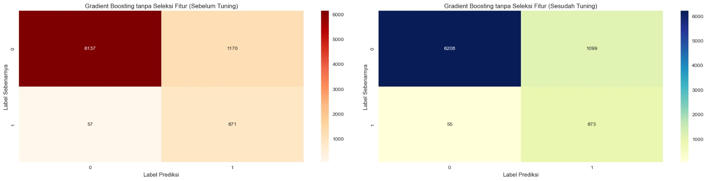
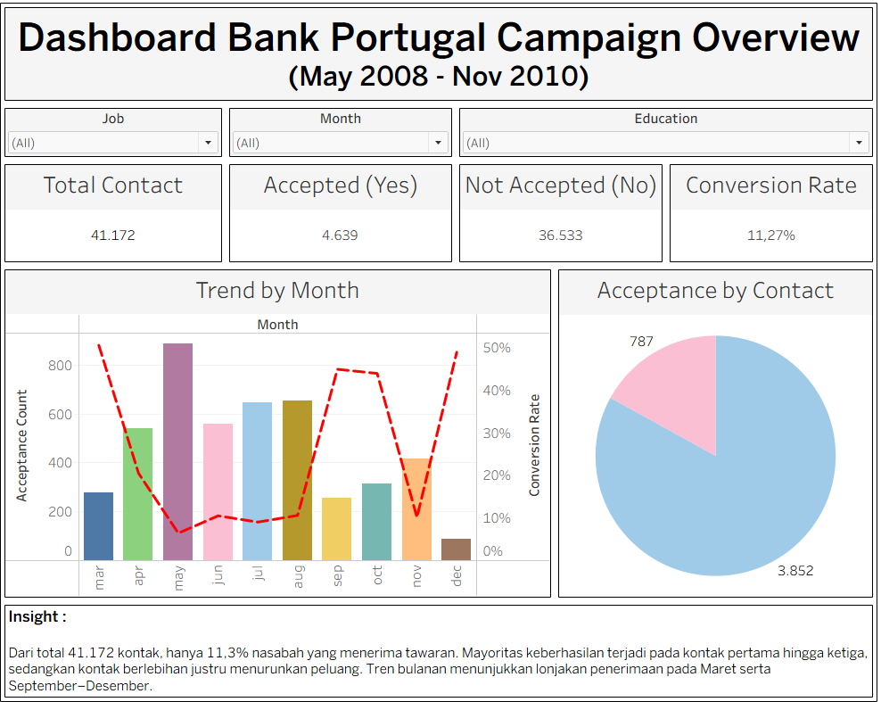

# 📊 Bank Marketing Campaign Analysis & Prediction

## 📌 Deskripsi Proyek
Proyek ini menganalisis data **Bank Marketing** dari sebuah bank di Portugal yang berfokus pada kampanye telemarketing. Data ini berasal dari UCI Machine Learning Repository, terdiri dari **41.172 baris data** hasil panggilan telepon yang ditujukan untuk menawarkan produk deposito berjangka.  

Target analisis adalah variabel **y (acceptance)** yang bernilai:
|                      | Prediksi Negatif (0) | Prediksi Positif (1) |
|----------------------|----------------------|----------------------|
| *Aktual Negatif (0)* | *6208 (TN)*          | *1099 (FP)*          |
| *Aktual Positif (1)* | *55 (FN)*            | *873 (TP)*           |  

Melalui proyek ini, dilakukan analisis mendalam untuk menjawab pertanyaan:
- Bagaimana **mengurangi panggilan yang tidak produktif** untuk menekan biaya operasional ?
- Bagaimana **meningkatkan CVR di atas baseline historis (~11%)**, sehingga kampanye telemarketing lebih efisien dan berdampak positif pada pendapatan bank ?

## 📌 Goals  
- **Mengurangi biaya operasional** dengan meminimalkan panggilan telemarketing yang tidak menghasilkan konversi.
- **Meningkatkan CVR dari baseline historis (~11%)** agar lebih tinggi dibandingkan rata-rata kampanye sebelumnya.
- **Meningkatkan pendapatan bank** melalui bertambahnya jumlah nasabah yang berlangganan deposito berjangka.
- Memberikan **dukungan keputusan berbasis data** kepada manajemen dalam merancang strategi pemasaran yang lebih tepat sasaran.

---

## 📂 Struktur Proyek
.
├── asssets/
│   ├── image.jpg                                                                      # hasil sebelum & setelah tuning model
│   └── imagee.png                                                                     # screenshot tableu
├── data/
│   ├── bank-additional-full.csv                                                       # data mentah
│   ├── bank-dummy-data.csv                                                            # data dummy
│   └── bank_additional_full_cleaned.csv                                               # data setelah preprocessing
├── notebooks/
│   └── FinalProject_BankMarketingCampaign.ipynb                                       # notebook final
├── streamlit_app/
│   ├── Streamlit_FinalProject.py                                                      # aplikasi prediksi
│   ├── final_model.sav                                                                # model machine learning final
│   ├── final_Model.pkl                                                                # model machine learning final
│   └── meta.json                                                                      # metadata fitur
├── tableau/
│   └── Final Project Bank Marketing Campaign (Team Beta JCDS 0612).twbx               # story : overview, segmentation, campaign effectiveness
├── reports/
│   ├── lime_explanation_FN_32                                                         # false negative case
│   ├── lime_explanation_FP_14                                                         # false positive case
│   ├── lime_explanation_TN_0                                                          # true negative case
│   ├── lime_explanation_TP_38                                                         # true positive case
│   └── Final_Project_TeamBeta_Presentation.pptx                                       # slide presentasi
├── README.md
└── requirements.txt

---

## 🔍 Temuan Utama
1. **Durasi panggilan** adalah faktor terkuat: panggilan lebih lama meningkatkan peluang acceptance.  
2. **Jumlah kontak** efektif pada 1–3 kali; lebih dari itu justru menurunkan peluang (customer fatigue).  
3. **Segmen student dan retired** memiliki conversion rate lebih tinggi, menunjukkan kelompok tertentu lebih responsif.  
4. **Pendidikan universitas** terkait dengan peluang keberhasilan lebih tinggi dibandingkan pendidikan dasar.  
5. **Waktu kampanye** berperan: tingkat penerimaan lebih tinggi di bulan September–Desember serta hari kerja pertengahan minggu.  

➡️ Interpretasi bisnis:  
Bank dapat menghemat biaya dengan membatasi jumlah kontak, fokus pada panggilan berkualitas, serta menargetkan segmen nasabah tertentu pada waktu yang tepat.  

---

## 🤖 Modeling
- Dilakukan feature selection menggunakan **RFECV** → menghasilkan **39 fitur optimal**.  
- Model yang diuji: Logistic Regression, KNN, Decision Tree, Random Forest, AdaBoost, Gradient Boosting, dan XGBoost.  
- Resampling digunakan untuk mengatasi imbalance target (`11% yes vs 89% no`).  
- Model terbaik: **Gradient Boosting (ROS)** dengan recall & F2 score seimbang.  
- Model disimpan sebagai `.pkl` untuk keperluan aplikasi prediksi.  

---

## 📊 Dashboard Tableau
Dashboard interaktif dibuat untuk membantu pengambilan keputusan:  
1. **Overview**: KPI utama, tren bulanan, distribusi kontak.  
2. **Segmentation**: Perbandingan acceptance berdasarkan job, education, marital.  
3. **Campaign Effectiveness**: Efektivitas jumlah kontak, durasi, dan hasil kampanye sebelumnya.  

Dashboard memberikan gambaran strategis tentang di mana kampanye lebih efektif dan kelompok mana yang lebih potensial. 

### 🔗 Link Tableu : [Tableu](https://public.tableau.com/app/profile/aldhi.nur.faith/viz/FinproBankMarketingCampaign_17590757378770/AllDataBankMarketingCampaign)

---

## 🌐 Aplikasi Streamlit
Aplikasi prediksi dibuat menggunakan **Streamlit**.  
Pengguna dapat memasukkan informasi calon nasabah dan mendapatkan prediksi apakah mereka akan menerima tawaran deposito.

### 🔗 Link Streamlit : [Streamlit](https://bankcampaignfinalproject.streamlit.app/)
